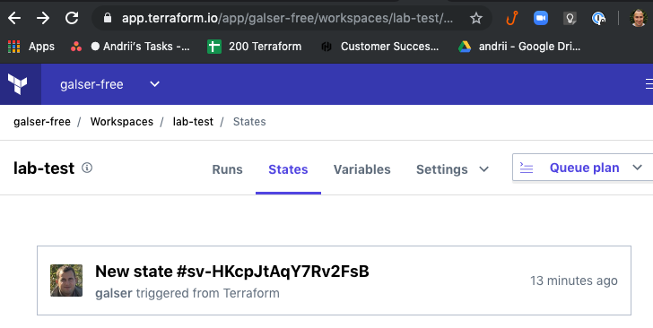
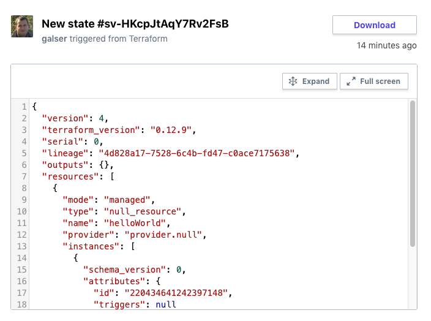

# tfe-remote-backend
TFE remote state backend
*Skills lab follow repo.*

# Requirements
This repo assumes general knowledge about Terraform, if not, please get yourself accustomed first by going through [getting started guide](https://learn.hashicorp.com/terraform?track=getting-started#getting-started).


# Idea
As our team grows, and collaboration is needed, having a local state file can cause a slowdown.

In order to overcome this, we can have a remote state.


# Instructions

- First, we'll use Terraform Cloud as our backend. Terraform Cloud offers free remote state management. Terraform Cloud is the recommended best practice for remote state storage.
If you don't have an account, please [sign up here for this guide](https://app.terraform.io/signup). For more information on Terraform Cloud, view this [getting started guide](https://learn.hashicorp.com/terraform/cloud/tf_cloud_gettingstarted).
- You'll also need a user token to authenticate with Terraform Cloud. You can generate one on the [user settings page](https://app.terraform.io/app/settings/tokens). Save generated user token somewhere safe. We are going to use this token as environment variable. Export it : 
    ```bash
    export ATLAS_TOKEN="YOUR_TOKEN_HERE"
    ```
- Now, create empty Git repo
- Clone it to your computer, using tools of your choice
- Create a new branch  (from here and later I am going to reference command-line Git tools) :
    ```bash
    git checkout -b f-test-backend
    ``` 
- Create Terraform code, [main.tf](main.tf) with contents : 
    ```terraform
    resource "null_resource" "helloWorld" {
        provisioner "local-exec" {
            command = "echo hello world"
        }
    }
    ```
- Init Terraform, execute :
    ```
    terraform init
    ```
    Output : 
    ```
    Initializing the backend...

    Initializing provider plugins...
    - Checking for available provider plugins...
    - Downloading plugin for provider "null" (hashicorp/null) 2.1.2...

    The following providers do not have any version constraints in configuration,
    so the latest version was installed.

    To prevent automatic upgrades to new major versions that may contain breaking
    changes, it is recommended to add version = "..." constraints to the
    corresponding provider blocks in configuration, with the constraint strings
    suggested below.

    * provider.null: version = "~> 2.1"

    Terraform has been successfully initialized!    
    ```
- Apply our code : 
    ```
    terraform apply
    ```
    Output
    ```
    An execution plan has been generated and is shown below.
    Resource actions are indicated with the following symbols:
      + create
        Terraform will perform the following actions:

    # null_resource.helloWorld will be created
    + resource "null_resource" "helloWorld" {
        + id = (known after apply)
        }

    Plan: 1 to add, 0 to change, 0 to destroy.

    Do you want to perform these actions?
    Terraform will perform the actions described above.
    Only 'yes' will be accepted to approve.

    Enter a value: yes

    null_resource.helloWorld: Creating...
    null_resource.helloWorld: Provisioning with 'local-exec'...
    null_resource.helloWorld (local-exec): Executing: ["/bin/sh" "-c" "echo hello world"]
    null_resource.helloWorld (local-exec): hello world
    null_resource.helloWorld: Creation complete after 0s [id=220434641242397148]
    ```

## Switch to remote backend

At the present moment, we have our state locally. Let's work as the team, we are about to switch to the remote backend. But this will include some preparational steps. 

- Create some organization in TFCLoud following this link [https://app.terraform.io/app/organizations/new](https://app.terraform.io/app/organizations/new)
- Then, inside that organization, create new workspace ( Follow the lin that looks like : https://app.terraform.io/app/YOPUR_ORGANIZATION/workspaces/new ). You wil have a message - that you need to choose the version control provider that hosts your Terraform source code, just press **skip** and fill details in the next screen. Write down your ORGANIZATION and WORKSPACE names
- Change [main.tf](main.tf) to include the new backend as follows : 
    ```terraform
    terraform {
    backend "atlas" {
        name    = "YOUR_ORGANOIZATION/WORKSPACE"
    }
    }

    resource "null_resource" "helloWorld" {
    provisioner "local-exec" {
        command = "echo hello world"
    }
    }
    ```
- Now we can use `git add` and `git commit` to add the updated file to our repo.
- We push to GitHUb and merge with a pull request.

> Note - you should have **ATLAS_TOKEN** exported as an environment variable, before next step

- Run terraform init to download and initialize the backend (you will need to answer `yes` for the backend question ) :
    ```
    terraform init                

    Initializing the backend...
    Do you want to copy existing state to the new backend?
      Pre-existing state was found while migrating the previous "local" backend to the
      newly configured "atlas" backend. No existing state was found in the newly
      configured "atlas" backend. Do you want to copy this state to the new "atlas"
      backend? Enter "yes" to copy and "no" to start with an empty state.

      Enter a value: yes


    Successfully configured the backend "atlas"! Terraform will automatically
    use this backend unless the backend configuration changes.

    Initializing provider plugins...

    The following providers do not have any version constraints in configuration,
    so the latest version was installed.

    To prevent automatic upgrades to new major versions that may contain breaking
    changes, it is recommended to add version = "..." constraints to the
    corresponding provider blocks in configuration, with the constraint strings
    suggested below.

    * provider.null: version = "~> 2.1"

    Terraform has been successfully initialized!

    You may now begin working with Terraform. Try running "terraform plan" to see
    any changes that are required for your infrastructure. All Terraform commands
    should now work.

    If you ever set or change modules or backend configuration for Terraform,
    rerun this command to reinitialize your working directory. If you forget, other
    commands will detect it and remind you to do so if necessary.
    ```
- Now we can go to our workspace dashboard 
And see that indeed, here is the one and only state :
 

and  if we open it, here are state details :




# Notes 

- For the modern TF Cloud we can also setup a token in special file  - Terraform CLI Configuration file. This file is located at `%APPDATA%\terraform.rc` on Windows systems, and `~/.terraformrc` on other systems, with following content :
    ```
        credentials "app.terraform.io" {
            token = "REPLACE_ME"
        }
    ```
    > Note replace the token above with your value from previous step
- And change config in main to look like : 
    ```terraform
    terraform {
    backend "remote" {
        organization = "GUSTEST"

        workspaces {
        name = "Example-Workspace"
        }
    }
    }
    ```

# TODO


# DONE
- [x] - main code
- [x] - update readme
- [x] - final update README
